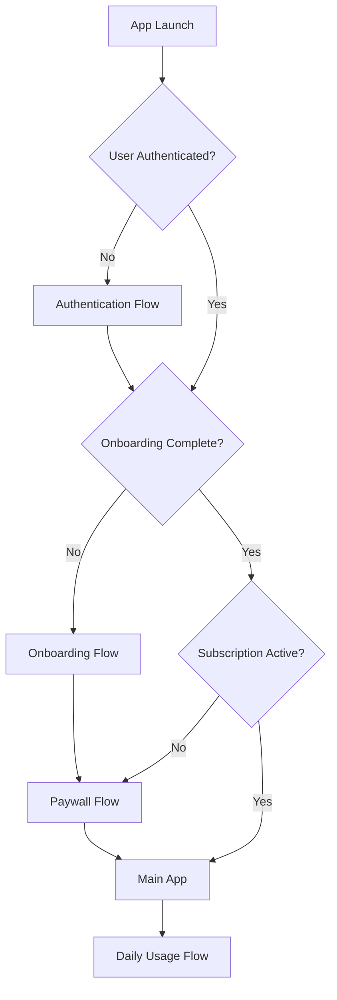

## 📋 Table of Contents

1. [Flow Overview](https://claude.ai/chat/1e22b17a-5a77-4709-b52a-f00e0099fa4d#flow-overview)
2. [Authentication Flows](https://claude.ai/chat/1e22b17a-5a77-4709-b52a-f00e0099fa4d#authentication-flows)
3. [Onboarding Flow](https://claude.ai/chat/1e22b17a-5a77-4709-b52a-f00e0099fa4d#onboarding-flow)
4. [Paywall Flow](https://claude.ai/chat/1e22b17a-5a77-4709-b52a-f00e0099fa4d#paywall-flow)
5. [Daily Usage Flows](https://claude.ai/chat/1e22b17a-5a77-4709-b52a-f00e0099fa4d#daily-usage-flows)
6. [Navigation Flows](https://claude.ai/chat/1e22b17a-5a77-4709-b52a-f00e0099fa4d#navigation-flows)
7. [Settings Flows](https://claude.ai/chat/1e22b17a-5a77-4709-b52a-f00e0099fa4d#settings-flows)
8. [Error Handling Flows](https://claude.ai/chat/1e22b17a-5a77-4709-b52a-f00e0099fa4d#error-handling-flows)
9. [Edge Case Flows](https://claude.ai/chat/1e22b17a-5a77-4709-b52a-f00e0099fa4d#edge-case-flows)
10. [Screen Specifications](https://claude.ai/chat/1e22b17a-5a77-4709-b52a-f00e0099fa4d#screen-specifications)
11. [State Management](https://claude.ai/chat/1e22b17a-5a77-4709-b52a-f00e0099fa4d#state-management)
12. [Technical Implementation](https://claude.ai/chat/1e22b17a-5a77-4709-b52a-f00e0099fa4d#technical-implementation)

## 🌊 Flow Overview

### App Flow Architecture

**Core User Journeys:**

1. **First-Time User:** Authentication → Onboarding → Paywall → First Daily Use
2. **Daily Active User:** App Launch → Task Completion → Analytics Review
3. **Returning User:** Authentication Check → Direct to Tasks
4. **Settings Management:** Profile Updates → Preferences → Time Configuration
5. **Support & Help:** Issue Reporting → FAQ → Contact Support



## 🔐 Authentication Flows

### 1. App Launch & Authentication Check

**Screen:** Splash Screen

**Flow Logic:**

1. App launches → Show splash screen (2 seconds max)
2. Check authentication state via Firebase Auth
3. Route based on auth status:
    - Authenticated + Onboarding Complete + Active Subscription → Main App
    - Authenticated + Onboarding Incomplete → Onboarding Flow
    - Authenticated + No Subscription → Paywall
    - Not Authenticated → Welcome Screen

**Technical Requirements:**

- Firebase Auth state listener
- Async data loading for user profile
- Proper error handling for network issues
- Smooth transition animations

### 2. Welcome Screen

**Screen:** Welcome/Landing

```
┌────────────────────────────────────────────────────────────────────────────────────────────
│                                                                                            │
│                                          [LOGO]                                           │
│                                                                                            │
│   │
│                                                                            
│                                                                                            │
│                                        [Loading...]                                       │
│                                                                                            │
└────────────────────────────────────────────────────────────────────────────────────────────

```

**UI Elements:**

- App logo/branding
- Loading indicator
- Smooth transitions to next screen

**Flow Logic:**

1. Display welcome screen during auth check
2. Auto-navigate based on authentication status
3. No user interaction required

### 3. Sign-Up/Sign-In Screen

**Authentication Options:**

- Email/Password registration
- Google Sign-In
- Apple Sign-In (iOS only)

**Validation:**

- Email format validation
- Password strength requirements (8+ chars, mix of letters/numbers)
- Real-time validation feedback

**Error Handling:**

- Network connectivity issues
- Invalid credentials
- Account already exists
- Password reset flow

## 🎯 Onboarding Flow

### 1. Welcome to Productivity Dawn

**Screen:** Intro Screen 1

**Content:**

- App introduction
- Value proposition
- Continue button

### 2. The Four Daily Tasks

**Screen:** Task Introduction

**Content:**

- 💧 Drink Water - Hydration reminder
- ⛔ No Phone Usage - Digital wellness
- ☀️ Sunlight Exposure - Natural vitamin D
- 🐘 Elephant Task - Important daily priority

### 3. Personalization Questions (14 Questions)

**Question 1 (Optional - Can Skip):**

- "What's your current biggest productivity challenge?"
- Multiple choice with skip option

**Questions 2-14 (Required):**

- Wake-up time preferences
- Work schedule
- Personal goals
- Habit preferences
- Motivation styles
- etc.

**Technical Notes:**

- Progress indicator
- Back/forward navigation
- Data validation for required fields
- Skip functionality for optional questions

### 4. Personalization Animation

**Screen:** Custom Plan Generation

**Animation Sequence:**

1. "Analyzing your responses..." (2s)
2. "Creating your personal plan..." (2s)
3. "Almost ready..." (1s)
4. Transition to plan display

### 5. Your Personalized Plan

**Screen:** Plan Display

**Content:**

- Customized wake-up time
- Personalized task schedule
- Motivational message based on responses
- Confirm/Edit options

## 💳 Paywall Flow

### 1. Subscription Options

**Screen:** Pricing

**Plans:**

- **Weekly:** $3.99/week
- **Yearly:** $24.99/year (Most Popular)

**Features Highlighted:**

- Unlimited access to all features
- Detailed analytics and insights
- Personalized motivational content
- Priority customer support

### 2. Purchase Flow

**Implementation:**

- React Native IAP integration
- iOS App Store/Google Play Store
- Receipt validation
- Subscription status management

**Error Handling:**

- Payment declined
- Network issues during purchase
- Subscription verification failures
- Restore purchase functionality

## 📱 Daily Usage Flows

### 1. Main App Screen (Tasks Tab)

**Screen Layout:**

```
┌────────────────────────────────────────────────────────────────────────────────────────────
│ Alex 🔔 ⚙️Settings                                                                         │
│                                                                                            │
│ Way to go, Alex! ⭐                                                                        │
│ Thursday, March 14                                                                         │
│                                                                                            │
│ ┌────────────────────────────────────────────────────────────────┐                       │
│ │ Today's Tasks: IN PROGRESS 🎯                                   │                       │
│ │                                                                  │                       │
│ │ 💧 Drink Water ✓                                                │                       │
│ │ ⛔ No Phone Usage ✓                                             │                       │
│ │ ☀️ Sunlight Exposure ○                                          │                       │
│ │ 🐘 Elephant Task ○                                              │                       │
│ │                                                                  │                       │
│ │ Score: 50% 📈                                                   │                       │
│ │ [Submit Day] [Not yet available]                                │                       │
│ └────────────────────────────────────────────────────────────────┘                       │
│                                                                                            │
│ Looking good! Keep it up! 💪                                                              │
│                                                                                            │
│ [📊] [🎯 Active] [⚙️]                                                                     │
└────────────────────────────────────────────────────────────────────────────────────────────

```

**Task Colors:**

```jsx
taskColors: {
  water: '#007AFF',         // Blue - iOS system blue
  noPhoneUsage: '#FF3B30',  // Red - iOS system red
  sunlight: '#FFCC00',      // Yellow - bright sunshine
  elephant: '#34C759'       // Green - iOS system green
}

```

### 2. Task Completion Flow

**Individual Task Interaction:**

1. User taps task → Toggle completion state
2. Show completion animation → Check mark with bounce effect
3. Record timestamp → Save completion time to database
4. Submit always available → Button remains active regardless of completion count
5. All tasks treated equally → No special inputs or descriptions required

**Submission Flow:**

1. User taps "Submit Day" → Confirmation modal
2. Calculate completion percentage
3. Show success animation with score
4. Display motivational message
5. Record submission timestamp
6. Update streak counter

## 🧭 Navigation Flows

### Bottom Tab Navigation

**Tab States:**

### 1. Analytics Tab

**Screen Content:**

```
┌────────────────────────────────────────────────────────────────────────────────────────────
│                                                                                            │
│                                      [Tab Content]                                        │
│                                                                                            │
│                                                                                            │
│                                                                                            │
│                                                                                            │
│                                                                                            │
│                                                                                            │
│                                                                                            │
│                                                                                            │
│                                   [📊] [🎯 Active] [⚙️]                                  │
└────────────────────────────────────────────────────────────────────────────────────────────

```

**Weekly View:**

- Monday
- Tuesday
- Wednesday
- Thursday
- Friday

**Color Legend:**

- 🔵 Blue dot (Water): Filled = completed, Empty = not completed
- 🔴 Red dot (No Phone Usage): Filled = completed, Empty = not completed
- 🟡 Yellow dot (Sunlight): Filled = completed, Empty = not completed
- 🟢 Green dot (Elephant): Filled = completed, Empty = not completed

**Week Navigation:**

- Swipeable interface for easy week browsing
- Historical data accessible
- Current week highlighted by default

**Analytics Features:**

- Weekly completion percentage based on total tasks completed
- Perfect days count (days with all 4 tasks completed)
- Individual task breakdown showing completion rates per task
- Streak tracking for overall consistency

### 2. Settings Tab

**Screen:** Settings Menu

**Options:**

- Profile management
- Notification settings
- Subscription management
- Support & help
- Privacy settings
- About app

## ⚙️ Settings Flows

### 1. Profile Management

**Editable Fields:**

- Display name
- Email address
- Profile picture
- Time zone

### 2. Notification Settings

**Options:**

- Daily reminder time (90 minutes after wake-up)
- Push notification permissions
- Sound/vibration preferences

### 3. Time Configuration

**Wake-up Time Picker:**

- Interactive time picker
- Validation: Work start time cannot be earlier than wake-up time
- Automatic calculation of notification time

### 4. Subscription Management

**Features:**

- Current subscription status
- Billing information
- Cancel subscription
- Restore purchases

## 🚨 Error Handling Flows

### 1. Network Connectivity

**Scenarios:**

- No internet connection
- Slow/unstable connection
- Server downtime

**Handling:**

- Offline mode with local data storage
- Sync when connection restored
- Clear error messaging
- Retry mechanisms

### 2. Authentication Errors

**Scenarios:**

- Invalid credentials
- Session expired
- Account locked

**Handling:**

- Clear error messages
- Password reset options
- Account recovery flows
- Support contact information

### 3. Payment Errors

**Scenarios:**

- Payment declined
- Subscription expired
- Store connection issues

**Handling:**

- Clear payment error messages
- Alternative payment methods
- Subscription restoration
- Grace period handling

## 🔄 Edge Case Flows

### 1. Timezone Changes

**Handling:**

- Detect timezone changes
- Adjust notification times
- Maintain streak calculations
- User confirmation for changes

### 2. Device Storage Full

**Handling:**

- Minimize local data storage
- Cloud sync priority
- User notification
- Data cleanup options

### 3. Subscription Expiry

**Handling:**

- Grace period (24-48 hours)
- Feature limitation
- Renewal prompts
- Data preservation

## 📋 Screen Specifications

### Design System

**Colors:**

- Primary: #FB9E3A (Sunrise Orange)
- Secondary: #E6521F (Dawn Red-Orange)
- Accent: #EA2F14 (Morning Red)
- Warning: #FCEF91 (Golden Morning)
- Background: #FEF9E6 (Soft Dawn)
- Text: #2D1810 (Dark Brown)
- Secondary Text: #8B5A3C (Warm Brown)

**Typography:**

- Headlines: SF Pro Display (iOS) / Roboto (Android)
- Body: SF Pro Text (iOS) / Roboto (Android)
- Sizes: 34pt, 28pt, 22pt, 20pt, 17pt, 15pt, 13pt, 11pt

**Spacing:**

- Base unit: 8pt
- Common spacings: 8pt, 16pt, 24pt, 32pt, 48pt

## 🗃️ State Management

### Redux Toolkit Implementation

```tsx
// Store configuration
const store = configureStore({
  reducer: {
    auth: authSlice.reducer,
    onboarding: onboardingSlice.reducer,
    subscription: subscriptionSlice.reducer,
    progress: progressSlice.reducer,
    ui: uiSlice.reducer,
  },
  middleware: (getDefaultMiddleware) =>
    getDefaultMiddleware({
      serializableCheck: {
        ignoredActions: [FLUSH, REHYDRATE, PAUSE, PERSIST, PURGE, REGISTER],
      },
    }),
});

// Persist configuration
const persistConfig = {
  key: 'root',
  storage: AsyncStorage,
  whitelist: ['auth', 'onboarding', 'progress'], // Only persist essential data
};

```

### App State Architecture

**State Slices:**

1. **Auth State:** User authentication, profile data
2. **Onboarding State:** Completion status, personalization responses
3. **Subscription State:** Plan details, billing status
4. **Progress State:** Task completion, streaks, analytics
5. **UI State:** Navigation, loading states, modal visibility

## 🔧 Technical Implementation

### Navigation Setup

```tsx
// Navigation structure
const AppNavigator = () => {
  return (
    <NavigationContainer>
      <Stack.Navigator>
        <Stack.Screen name="Splash" component={SplashScreen} />
        <Stack.Screen name="Auth" component={AuthFlow} />
        <Stack.Screen name="Onboarding" component={OnboardingFlow} />
        <Stack.Screen name="Paywall" component={PaywallFlow} />
        <Stack.Screen name="Main" component={MainTabNavigator} />
      </Stack.Navigator>
    </NavigationContainer>
  );
};

const MainTabNavigator = () => {
  return (
    <Tab.Navigator>
      <Tab.Screen name="Analytics" component={AnalyticsScreen} />
      <Tab.Screen name="Tasks" component={TasksScreen} />
      <Tab.Screen name="Settings" component={SettingsScreen} />
    </Tab.Navigator>
  );
};

```

### Firebase Integration

```tsx
// Firebase configuration
const firebaseConfig = {
  // Configuration details
};

// Auth setup
import auth from '@react-native-firebase/auth';
import firestore from '@react-native-firebase/firestore';

// Authentication methods
const signInWithEmail = async (email: string, password: string) => {
  try {
    await auth().signInWithEmailAndPassword(email, password);
  } catch (error) {
    // Handle error
  }
};

```

### Push Notifications

```tsx
// Notification setup
import PushNotification from 'react-native-push-notification';

const scheduleNotification = (wakeUpTime: Date) => {
  const notificationTime = new Date(wakeUpTime.getTime() + 90 * 60000); // 90 minutes later

  PushNotification.localNotificationSchedule({
    title: "Morning Check-in",
    message: "Ready to start your productive day?",
    date: notificationTime,
    repeatType: 'day',
  });
};

```

## 📊 Analytics & Tracking

### Key Metrics

**User Engagement:**

- Daily active users
- Task completion rates
- Streak lengths
- Session duration

**Business Metrics:**

- Conversion rates (free to paid)
- Subscription retention
- Churn rate
- Revenue per user

### Implementation

```tsx
// Analytics tracking
import analytics from '@react-native-firebase/analytics';

const trackEvent = async (eventName: string, parameters: object) => {
  await analytics().logEvent(eventName, parameters);
};

// Example usage
trackEvent('task_completed', {
  task_type: 'water',
  completion_time: new Date().toISOString(),
});

```

## 🧪 Testing Strategy

### Testing Types

- **Unit Testing:** Core business logic functions and utility helpers
- **Integration Testing:** Firebase service integrations and API connections
- **Component Testing:** UI component behavior with NativeWind styling
- **Visual Testing:** Style consistency across different screen sizes
- **Performance Testing:** App launch time, memory usage, animation smoothness
- **Security Testing:** Authentication flows and data protection
- **Accessibility Testing:** Screen reader navigation and touch target sizes
- **Device Testing:** Multiple iOS and Android devices with different screen sizes

### Test Scenarios

**Critical Paths:**

- Complete user registration and onboarding (including optional skip functionality)
- Interactive time picker functionality (wake time and work start time selection)
- Time validation: Test work start time cannot be earlier than wake up time
- Daily task completion and submission
- Subscription purchase and management
- Push notification delivery and handling (fixed 90-minute timing)

### Flow Testing Checklist

- Happy path testing for all major flows
- Error state testing (network, auth, payment)
- Edge case testing (timezone, subscription expiry)
- Cross-platform testing (iOS + Android)
- Accessibility testing (VoiceOver, TalkBack)
- Performance testing (large data sets, slow networks)

## 📚 Documentation Updates

**Required Documentation:**

- API integration documentation
- Error handling guidelines
- Animation specifications
- Accessibility compliance
- Testing procedures

---

**Document Version:** 1.0

**Last Updated:** [Current Date]

**Next Review:** [Date + 2 weeks]

*This flow document should be updated as features are implemented and user feedback is incorporated.*